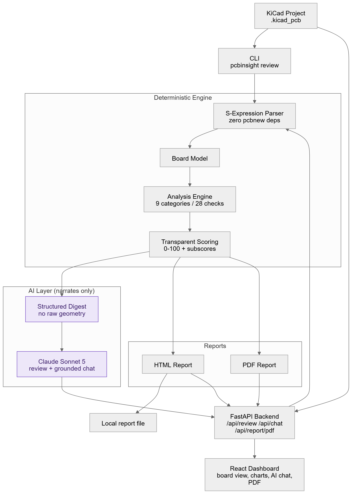

# Architecture

See `DESIGN.md` at the repo root for the full rationale and phased plan.



Source: [`images/architecture.mmd`](images/architecture.mmd) (Mermaid — edit and re-render this, not the PNG directly) and [`images/architecture.excalidraw`](images/architecture.excalidraw) (open at [excalidraw.com](https://excalidraw.com) for a quick manual tweak).

## Pipeline

```
KiCad project upload
    -> parser (backend/app/parser)         builds Board model
    -> analysis engine (backend/app/analysis)  Board -> list[Issue]
    -> scoring (backend/app/analysis/scoring)  list[Issue] -> EngineeringScore
    -> AI summarizer (backend/app/ai/summarizer)  Board + Issues -> structured digest
    -> AI review (backend/app/ai/review)   digest -> narrative review (Claude)
    -> report (backend/app/reports)        Board + Issues + Score + review -> HTML/PDF
```

## Key boundary

Claude never receives raw KiCad files or geometry — only the structured digest produced by `app/ai/summarizer.py`. This keeps the AI layer bounded, auditable, and clearly additive rather than load-bearing.
